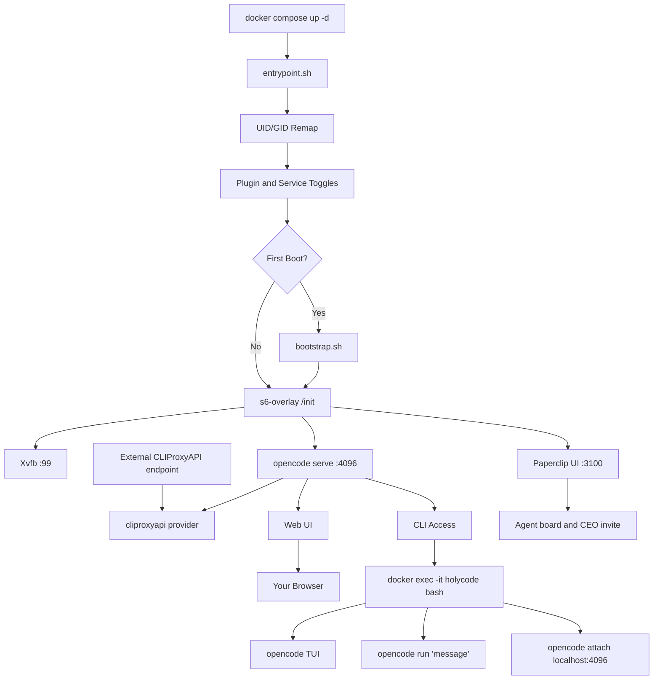

🌍 **English** | [Español](docs/translations/README.es.md) | [Français](docs/translations/README.fr.md) | [Italiano](docs/translations/README.it.md) | [Português](docs/translations/README.pt.md) | [Deutsch](docs/translations/README.de.md) | [Русский](docs/translations/README.ru.md) | [हिन्दी](docs/translations/README.hi.md) | [中文](docs/translations/README.zh.md) | [日本語](docs/translations/README.ja.md) | [한국어](docs/translations/README.ko.md)

<a name="top"></a>

#  HolyCode

<div align="center">
  
</div>

<p align="center">

[](https://opensource.org/licenses/MIT)
[](https://github.com/aussielunix/HolyCode/pkgs/container/holycode)
[](https://github.com/aussielunix/holycode)
[](https://x.com/CoderLuii)
[](https://www.paypal.com/donate/?hosted_button_id=PM2UXGVSTHDNL)
[](https://buymeacoffee.com/CoderLuii)
[](https://coderluii.dev)
[](https://github.com/aussielunix/holycode/releases)
[](https://github.com/aussielunix/holycode/issues)
[](https://github.com/aussielunix/holycode/graphs/contributors)

</p>

### One container. Every tool. Any provider.

> **Stop maintaining. Start building.** A hosted AI workstation. Always-on Linux box. [holycode.cloud](https://holycode.cloud/?ref=hcode-readme)

OpenCode running in a container with everything already installed. 50+ dev tools, 10+ AI providers, a sandboxed headless browser, persistent state, and Paperclip on top. Drop it on any machine and pick up exactly where you left off.

**Hermes remains temporarily unbundled.** HolyCode leaves `/home/opencode/.hermes` untouched so you can restore the service if managed bundling returns.

**Paperclip turns HolyCode into an agent board.** You get a dashboard on port `3100` where you create a company, hire OpenCode-backed workers, wake them on heartbeat, and manage agent work from a real UI instead of hand-rolling scripts around `opencode run`.

**Works with your Claude subscription.** Enable the Claude Auth plugin and use your existing Claude Max/Pro plan. No separate API key needed.

**Bring your own multi-agent plugin for now.** HolyCode-managed oh-my-openagent installation remains suspended. The first flag-free start disables the old managed plugin entry but keeps its settings, skills, and package cache.

**You were going to spend an hour getting your environment back. Or you could just `docker compose up` and get a coding workstation and an agent board in one shot.**

---

## What is this?

You know the drill. You get your dev environment exactly right. Then you switch machines. Or rebuild a container. Or your system decides today is the day it dies.

Suddenly you're reinstalling tools. Hunting down config files. Re-entering API keys. Wondering why ripgrep isn't on PATH anymore. Figuring out why Chromium won't launch because Docker gives containers 64MB of shared memory. Then Xvfb isn't configured. Then the UID inside the container doesn't match your host and everything is permission denied.

**HolyCode is the container I built after solving every single one of those problems.**

It wraps [OpenCode](https://opencode.ai), an AI coding agent with a built-in web UI. All your settings, sessions, MCP configs, plugins, and tool history live in a bind mount outside the container. Rebuild, update, or move to a new machine. Your state comes right back.

It's the same idea as [HolyClaude](https://github.com/coderluii/holyclaude) but wrapping OpenCode instead of Claude Code. And here's the thing: OpenCode isn't locked to one provider. Point it at Anthropic, OpenAI, Google Gemini, Groq, AWS Bedrock, or Azure OpenAI. Same container, your choice of model.

50+ dev tools, two language runtimes, a sandboxed headless browser stack, process supervision, and an optional Paperclip agent board. All wired up, all ready on first boot. I've been running this on my own server. Every bug has been hit, diagnosed, and fixed.

You pull it. You run it. You open your browser. You build.

---

## Table of Contents

| | Section |
|---|---------|
| 1 | [Quick Start](#-quick-start) |
| 2 | [HolyCode Cloud (Live)](#-holycode-cloud-live) |
| 3 | [Platform Support](#-platform-support) |
| 4 | [Why HolyCode](#-why-holycode) |
| 5 | [Provider Support](#-provider-support) |
| 6 | [Docker Compose - Quick](#-docker-compose---quick) |
| 7 | [Docker Compose - Full](#-docker-compose---full) |
| 8 | [Podman](#-podman) |
| 9 | [Environment Variables](#-environment-variables) |
| 10 | [What's Inside](#-whats-inside) |
| 11 | [Bundled Services](#-bundled-services) |
| 12 | [Architecture](#-architecture) |
| 13 | [CLI Usage](#-cli-usage) |
| 14 | [Data and Persistence](#-data-and-persistence) |
| 15 | [Permissions](#-permissions) |
| 16 | [Upgrading](#-upgrading) |
| 17 | [Troubleshooting](#-troubleshooting) |
| 18 | [Building Locally](#-building-locally) |
| 19 | [Contributing](#-contributing) |
| 20 | [Support](#-support) |
| 21 | [License](#-license) |

---

## 🚀 Quick Start

**Step 1.** Pull the image.

```bash
docker pull ghcr.io/aussielunix/holycode:latest
```

**Step 2.** Create a `docker-compose.yaml`.

The Compose file uses HolyCode's Chromium seccomp profile. If you are not running from a clone of this repository, download the release copy first:

```bash
mkdir -p config
curl -fsSLo config/chromium-seccomp.json \
  https://raw.githubusercontent.com/CoderLuii/HolyCode/v1.1.3/config/chromium-seccomp.json
```

```yaml
services:
  holycode:
    image: ghcr.io/aussielunix/holycode:latest
    container_name: holycode
    restart: unless-stopped
    shm_size: 2g
    security_opt:
      - seccomp=./config/chromium-seccomp.json
    ports:
      - "4096:4096"
    volumes:
      - ./data/opencode:/home/opencode
      - ./local-cache/opencode:/home/opencode/.cache/opencode
      - ./workspace:/workspace
    environment:
      - PUID=1000
      - PGID=1000
      - ANTHROPIC_API_KEY=your-key-here
```

In that example, `/home/opencode` is the fixed path **inside** the container. On the host, `./data/opencode` and `./local-cache/opencode` are just example bind-mount paths relative to the folder containing your `docker-compose.yaml`. You can replace them with any host paths you want.

**Step 3.** Start it.

```bash
docker compose up -d
```

Open http://localhost:4096. You're in.

> The shipped `docker-compose.yaml` uses `${ANTHROPIC_API_KEY}` syntax which reads from your shell environment or a `.env` file. Copy `.env.example` to `.env` and fill in your API key.

> `./data/opencode` is only an example host path. If your compose file lives at `/opt/holycode`, that same bind mount becomes `/opt/holycode/data/opencode` on the host.

> Keep `./local-cache/opencode` on local disk. If this project folder lives on NAS/CIFS/SMB storage, change that cache mount to an absolute local host path instead.

<p align="right">
  <a href="#top">back to top</a>
</p>

---

## ☁ HolyCode Cloud (Live)

HolyCode Cloud is a hosted AI workstation with an always-on Linux box.

**What you get with Cloud:**
- Zero setup. No Docker, no config files, no terminal commands.
- Works on any device. Laptop, tablet, phone. Open a browser and go.
- Tagged releases refresh OpenCode and the tool pins for you.
- Your state follows you. Sessions, settings, MCP configs saved between uses.

**[Open HolyCode Cloud](https://holycode.cloud/?ref=hcode-readme)**

<p align="right">
  <a href="#top">back to top</a>
</p>

---

## 💻 Platform Support

| Platform | Architecture | Status |
|----------|-------------|--------|
| Linux | amd64 | Supported |
| Linux | arm64 | Supported |
| macOS (Docker Desktop) | amd64 / arm64 | Supported |
| Windows (WSL2) | amd64 | Supported |

<p align="right">
  <a href="#top">back to top</a>
</p>

---

## ⚡ Why HolyCode

I built this because I was tired of re-doing the same setup every time. Installing OpenCode, wiring up a headless browser, fixing permission issues, debugging process supervision. Every. Time.

So I made a container that does all of it. And then I hit every possible bug so you don't have to.

| | HolyCode | DIY |
|---|----------|-----|
| Time to first working session | Under 2 minutes | 30-60 minutes |
| Chromium + Xvfb headless browser | Pre-configured | Research, install, debug yourself |
| Dev tool suite (ripgrep, fzf, lazygit, etc.) | Pre-installed | Hunt down and install one by one |
| State persistence across rebuilds | Automatic via bind mount | Manual bind mounts, easy to misconfigure |
| UID/GID file permission remapping | Built-in PUID/PGID | Dockerfile chmod hacks |
| Multi-arch support | amd64 + arm64 out of the box | Build and push both yourself |
| Updates | `docker pull` + `compose up` | Rebuild from scratch, hope nothing breaks |

<p align="right">
  <a href="#top">back to top</a>
</p>

---

## 🤖 Provider Support

OpenCode is provider-agnostic. Set whichever API key you use and you're done.

| Provider | Environment Variable | Notes |
|----------|---------------------|-------|
| Anthropic | `ANTHROPIC_API_KEY` | Claude models |
| OpenAI | `OPENAI_API_KEY` | GPT models |
| Google Gemini | `GEMINI_API_KEY` | Gemini models |
| Groq | `GROQ_API_KEY` | Fast inference |
| AWS Bedrock | `AWS_ACCESS_KEY_ID`, `AWS_SECRET_ACCESS_KEY`, `AWS_REGION` | Set all three |
| Azure OpenAI | `AZURE_OPENAI_ENDPOINT`, `AZURE_OPENAI_API_KEY`, `AZURE_OPENAI_API_VERSION` | Set all three |
| GitHub | `GITHUB_TOKEN` | GitHub Copilot via OpenAI-compatible endpoint |
| Vertex AI | (configured via OpenCode) | Google Vertex AI models |
| GitHub Models | (configured via OpenCode) | GitHub-hosted models |
| Ollama | (configured via OpenCode) | Local models via Ollama |

You only need to set keys for providers you actually use. Everything else is optional and ignored.

Vertex AI, GitHub Models, and Ollama are configured through OpenCode's provider system. Run `opencode providers login` inside the container.

<p align="right">
  <a href="#top">back to top</a>
</p>

---

## 📋 Docker Compose - Quick

The minimal setup. Copy, fill in your key, run.

```yaml
services:
  holycode:
    image: ghcr.io/aussielunix/holycode:latest
    container_name: holycode
    restart: unless-stopped
    shm_size: 2g              # Required for Chromium stability
    ports:
      - "4096:4096"           # OpenCode web UI
    volumes:
      - ./data/opencode:/home/opencode
      - ./local-cache/opencode:/home/opencode/.cache/opencode
      - ./workspace:/workspace  # Your project files
    environment:
      - PUID=1000
      - PGID=1000
      - ANTHROPIC_API_KEY=your-key-here  # Or swap for any provider key
```

<p align="right">
  <a href="#top">back to top</a>
</p>

---

## 📄 Docker Compose - Full

Every option documented. Copy to `docker-compose.yaml` and uncomment what you need.

```yaml
# HolyCode - Full Configuration Reference
# Copy this file to docker-compose.yaml and customize.
# All options documented. Uncomment what you need.

services:
  holycode:
    image: ghcr.io/aussielunix/holycode:latest
    container_name: holycode
    restart: unless-stopped
    shm_size: 2g

    ports:
      - "4096:4096"   # OpenCode web UI

    volumes:
      # --- Main HolyCode data ---
      # Pick any host path you want here. This path maps to /home/opencode in the container.
      # It can live on local disk or network storage.
      - ./data/opencode:/home/opencode

      # --- Cache path ---
      # Keep this one on LOCAL disk for plugin/cache reliability.
      # If your main data path lives on NAS/CIFS/SMB, make this a separate local path.
      - ./local-cache/opencode:/home/opencode/.cache/opencode

      # --- Workspace ---
      - ./workspace:/workspace   # Your project files

    environment:
      # --- Container user ---
      - PUID=1000                # Match your host UID for file permissions
      - PGID=1000                # Match your host GID for file permissions

      # --- Git identity (used on first boot) ---
      # - GIT_USER_NAME=Your Name
      # - GIT_USER_EMAIL=you@example.com

      # --- AI provider API keys (add the ones you use) ---
      - ANTHROPIC_API_KEY=${ANTHROPIC_API_KEY:-}
      # - OPENAI_API_KEY=${OPENAI_API_KEY:-}
      # - GEMINI_API_KEY=${GEMINI_API_KEY:-}
      # - GROQ_API_KEY=${GROQ_API_KEY:-}
      # - GITHUB_TOKEN=${GITHUB_TOKEN:-}

      # --- AWS Bedrock (uncomment all 3 for Bedrock) ---
      # - AWS_ACCESS_KEY_ID=
      # - AWS_SECRET_ACCESS_KEY=
      # - AWS_REGION=us-east-1

      # --- Azure OpenAI (uncomment all 3 for Azure) ---
      # - AZURE_OPENAI_ENDPOINT=
      # - AZURE_OPENAI_API_KEY=
      # - AZURE_OPENAI_API_VERSION=

      # --- OpenCode behavior (set by default in image, override if needed) ---
      # - OPENCODE_DISABLE_AUTOUPDATE=true
      # - OPENCODE_DISABLE_TERMINAL_TITLE=true
      # - OPENCODE_MODEL=claude-sonnet-4-6
      # - OPENCODE_PERMISSION=auto
      # - OPENCODE_DISABLE_LSP_DOWNLOAD=true
      # - OPENCODE_DISABLE_AUTOCOMPACT=true
      # - OPENCODE_ENABLE_EXA=true

      # --- Web UI Security (basic auth for opencode serve) ---
      # - OPENCODE_SERVER_PASSWORD=your-password
      # - OPENCODE_SERVER_USERNAME=opencode

      # --- Claude Auth (use Claude subscription instead of API key) ---
      # Reads credentials from ./data/opencode/.claude/.credentials.json
      # NOTE: May violate Anthropic TOS. Use at your own risk.
      # Toggle on/off with docker compose down && up -d
      # - ENABLE_CLAUDE_AUTH=true

      # --- Legacy oh-my-openagent flag ---
      # Managed installation is currently unavailable. Existing config is preserved.
      # Remove this flag before upgrading; true stops with a migration message.
      # - ENABLE_OH_MY_OPENAGENT=true
```

CLIProxyAPI remains supported as an external OpenAI-compatible endpoint. HolyCode does not bundle its Docker sidecar until its release binaries have verifiable compiler provenance and pass `govulncheck`. Set `CLIPROXYAPI_BASE_URL` to an endpoint that the HolyCode container can reach; this does not replace Claude Auth.

<p align="right">
  <a href="#top">back to top</a>
</p>

---

## 🐳 Podman

Prefer Podman? HolyCode uses the same container image there too. The Podman guide covers the minimal `podman run` setup, env-file usage, SELinux labels, rootless permissions, and update/recreate behavior.

**[Read the Podman guide](docs/podman.md)**

<p align="right">
  <a href="#top">back to top</a>
</p>

---

## 🔧 Environment Variables

| Variable | Default | Purpose |
|----------|---------|---------|
| `PUID` | `1000` | Container user UID, match your host for correct file ownership |
| `PGID` | `1000` | Container user GID, match your host for correct file ownership |
| `GIT_USER_NAME` | `HolyCode User` | Git identity configured on first boot |
| `GIT_USER_EMAIL` | `noreply@holycode.local` | Git identity configured on first boot |
| `ANTHROPIC_API_KEY` | (none) | Anthropic Claude |
| `OPENAI_API_KEY` | (none) | OpenAI GPT models |
| `GEMINI_API_KEY` | (none) | Google Gemini |
| `GROQ_API_KEY` | (none) | Groq fast inference |
| `GITHUB_TOKEN` | (none) | GitHub CLI auth and Copilot |
| `AWS_ACCESS_KEY_ID` | (none) | AWS Bedrock - set all three AWS vars |
| `AWS_SECRET_ACCESS_KEY` | (none) | AWS Bedrock |
| `AWS_REGION` | (none) | AWS Bedrock region (e.g. `us-east-1`) |
| `AZURE_OPENAI_ENDPOINT` | (none) | Azure OpenAI - set all three Azure vars |
| `AZURE_OPENAI_API_KEY` | (none) | Azure OpenAI |
| `AZURE_OPENAI_API_VERSION` | (none) | Azure OpenAI API version |
| `OPENCODE_DISABLE_AUTOUPDATE` | `true` | Prevent OpenCode from self-updating inside the container (does not affect plugins) |
| `OPENCODE_DISABLE_TERMINAL_TITLE` | `true` | Prevent OpenCode from changing the terminal title |
| `OPENCODE_MODEL` | (none) | Override the default model |
| `OPENCODE_PERMISSION` | (none) | Set to `auto` to skip permission prompts |
| `OPENCODE_DISABLE_LSP_DOWNLOAD` | (none) | Disable automatic LSP server downloads |
| `OPENCODE_DISABLE_AUTOCOMPACT` | (none) | Disable automatic context compaction |
| `OPENCODE_ENABLE_EXA` | (none) | Enable Exa web search integration |
| `OPENCODE_SERVER_PASSWORD` | (none) | Protect the web UI with basic auth |
| `OPENCODE_SERVER_USERNAME` | `opencode` | Username for web UI basic auth |
| `ENABLE_CLAUDE_AUTH` | (none) | Set to `true` to use Claude subscription instead of API key |
| `ENABLE_OH_MY_OPENAGENT` | (none) | Legacy flag; `true` stops startup because managed installation is suspended |
| `ENABLE_PAPERCLIP` | (none) | Set to `true` to start the Paperclip dashboard and agent board |
| `PAPERCLIP_PORT` | `3100` | Override the container port used by Paperclip |
| `PAPERCLIP_INSTANCE_ID` | `default` | Local Paperclip instance name for isolated state |
| `PAPERCLIP_DEPLOYMENT_MODE` | `authenticated` | Docker-safe Paperclip startup mode; HolyCode defaults this away from `local_trusted` |
| `PAPERCLIP_BIND` | `lan` | Paperclip reachability preset used on first boot; `lan` binds inside Docker on `0.0.0.0` |
| `PAPERCLIP_ALLOWED_HOSTNAMES` | (none) | Comma-separated Paperclip remote hostnames/IPs to allow; use hostname/IP only, no scheme or port |
| `ENABLE_HERMES` | (none) | Legacy flag; `true` stops startup with a migration message while bundled Hermes is unavailable |
| `CLIPROXYAPI_ENABLED` | (none) | Set to `true` to add the optional OpenCode `cliproxyapi` provider |
| `CLIPROXYAPI_BASE_URL` | `http://cliproxyapi:8317/v1` | Externally managed CLIProxyAPI base URL reachable from the HolyCode container |
| `CLIPROXYAPI_API_KEY` | (none) | Optional API key for CLIProxyAPI, stored only as an OpenCode env reference when set |
| `CLIPROXYAPI_MODELS` | (none) | Optional comma-separated model IDs exposed as `cliproxyapi/<model>`; when all model settings are empty, HolyCode discovers `/v1/models` at startup |
| `CLIPROXYAPI_MODEL` | (none) | Backward-compatible single primary model ID; also merged into `CLIPROXYAPI_MODELS` when both are set |
| `CLIPROXYAPI_SMALL_MODEL` | (none) | Optional additional smaller/faster model ID |
| `HOLYCODE_PLUGIN_UPDATE` | `manual` | Plugin update mode: `manual` (install if missing and keep user versions) or `auto` (sync declared pins on boot) |

> The supported `ENABLE_CLAUDE_AUTH` toggle takes effect on container restart. Set the env var and run `docker compose down && docker compose up -d`.

> `HOLYCODE_PLUGIN_UPDATE` controls supported plugin package updates. `manual` (default) installs Claude Auth only if it is missing and keeps a user-selected version. `auto` syncs the image's declared Claude Auth pin on boot. This is separate from `OPENCODE_DISABLE_AUTOUPDATE`, which only affects OpenCode itself.

> HolyCode-managed oh-my-openagent installation is currently unavailable. If an older deployment still sets `ENABLE_OH_MY_OPENAGENT=true`, startup stops without changing plugin state. After you remove the flag, the first successful start removes the old active entry from `opencode.json` and `tui.json`, records its original package spec in `.holycode-oh-my-openagent-migrated-v1.1.4`, and keeps the plugin settings, skills, and package cache. Add the plugin back manually only after reviewing it for your environment; HolyCode then leaves that user-managed entry alone.

> `ENABLE_PAPERCLIP=true` starts Paperclip on port `3100` inside the container. Open the dashboard, create a company, then hire OpenCode-backed agents there. Paperclip persists under `~/.paperclip` automatically.

> Paperclip runs with `HOME=/home/opencode` and XDG paths under `/home/opencode`, matching the OpenCode web service. That keeps the OpenCode adapter on `/home/opencode/.config/opencode` instead of `/root/.config/opencode`.

> HolyCode starts Paperclip with `PAPERCLIP_DEPLOYMENT_MODE=authenticated` and `PAPERCLIP_BIND=lan` by default. That keeps authentication on while allowing Docker port publishing through `0.0.0.0`.

> `PAPERCLIP_ALLOWED_HOSTNAMES` lets Paperclip accept listed LAN/private hostnames or IPs. Use comma-separated hostname/IP values only, without `http://`, `https://`, or ports. Restart the container after changing it. The hostname guard and Paperclip authentication stay enabled.

> The bundled Hermes service is currently unavailable. If an older deployment still sets `ENABLE_HERMES=true`, startup stops with a migration message instead of silently ignoring the flag. Your `/home/opencode/.hermes` data is not changed.

> `CLIPROXYAPI_ENABLED=true` adds a separate OpenCode provider named `cliproxyapi`. When every model setting is empty, HolyCode discovers model IDs from the endpoint's `/v1/models` response before OpenCode starts. The integration does not change `ENABLE_CLAUDE_AUTH`, touch `/home/opencode/.claude`, or set global `ANTHROPIC_*` proxy variables. Set `CLIPROXYAPI_BASE_URL` to your externally managed service and keep its credentials and network exposure outside the HolyCode container.

> `GIT_USER_NAME` and `GIT_USER_EMAIL` are only applied on first boot. To re-apply, delete the sentinel file and restart: `docker exec holycode rm /home/opencode/.config/opencode/.holycode-bootstrapped` then `docker compose restart`.

<p align="right">
  <a href="#top">back to top</a>
</p>

---

## 📦 What's Inside

<details>
<summary><strong>Core tools</strong></summary>

| Tool | Purpose |
|------|---------|
| `git` | Version control |
| `ripgrep` | Fast file content search |
| `fd` | Fast file finder |
| `fzf` | Fuzzy finder |
| `bat` | Cat with syntax highlighting |
| `eza` | Modern ls replacement |
| `lazygit` | Terminal git UI |
| `delta` | Better git diffs |
| `gh` | GitHub CLI |
| `htop` | Process monitor |
| `tar` | Archive creation and extraction |
| `tree` | Directory tree visualization |
| `less` | Paged file viewer |
| `vim` | Terminal text editor |
| `tmux` | Terminal multiplexer |

</details>

<details>
<summary><strong>Language runtimes</strong></summary>

| Runtime | Version |
|---------|---------|
| Node.js | 24.21.0 (LTS) |
| npm | 12.0.2 |
| Python | 3.13 (Trixie) |
| pip | Bundled with Python 3.13 |

</details>

<details>
<summary><strong>v1.2.3 release pins</strong></summary>

| Component | Version |
|-----------|---------|
| OpenCode | 2.0.18 |
| OpenSpec | 1.13.2; telemetry disabled, initialize a project explicitly with `openspec init --tools opencode` |
| npm | 12.1.0 with integrity-verified `brace-expansion` 5.0.12 and `ip-address` 10.7.2 replacements |
| PM2 | 7.0.4 with owner-guarded `js-yaml` 4.3.2 replacement |
| Paperclip | 2026.831.1 compatibility hold with reviewed Undici 6.28.1 replacement; no new migration or native-runner default override |
| Hermes | Bundled service temporarily removed; existing `.hermes` data is preserved |
| CLIProxyAPI | Bundled sidecar removed; external endpoints remain supported |
| s6-overlay | 3.2.3.2 |
| eza | 0.23.5 |
| fzf | 0.74.4 |
| lazygit | 0.65.1 |
| pnpm | 12.6.0 |
| Vite | 8.3.1 |
| ESLint | 10.11.0 |
| Prettier | 3.9.9 |
| Wrangler | 4.138.0 with Miniflare 5.20260921.1-alpha, workerd 1.20260921.1, and upstream-owned, integrity-verified `sharp` 0.35.4; legacy service environments are not supported |
| Prisma | 7.10.0 |
| Lighthouse | 13.5.0 |
| Netlify CLI and `serve` | Removed |
| Hermes, Vercel, sharp-cli, concurrently, LHCI | Not bundled |
| Matplotlib / tqdm | 3.11.2 / 4.70.1 |
| FastAPI / Uvicorn | 0.141.1 / 0.53.0 |
| Playwright / pandas | 1.63.0 / 3.0.6 |
| Claude stable | 2.1.281 |
| GitHub CLI | 2.101.0, built from signed upstream commit `0cf1092493af067646fc5f3db9421c6a6ec9c938` |
| tsx | 4.23.15 |
| TypeScript | 6.0.3, held because TypeScript 7 removes the `tsserver` command and changes the stable programmatic API surface |
| NumPy | 2.5.3 on Python 3.13 |
| json-server | 0.17.4, held on the stable release instead of the 1.0 beta |
| opencode-claude-auth default | 2.2.1, integrity-verified and installed offline from the image; refresh issue #11 remains open |
| oh-my-openagent | HolyCode-managed installation suspended; legacy active entry disabled once while settings, skills, and cache remain |

Release assets use digests, checksums, and action SHAs for hardening. npm lifecycle scripts are installed disabled, then their exact package version, integrity, architecture, and script body are validated before the approved scripts run. Releases build a Linux amd64 image and publish to GitHub Container Registry as `ghcr.io/aussielunix/holycode` with provenance attestations. Pull requests run static checks plus a native build and smoke test. No Docker Hub, Docker Scout, or Trivy account is required.

The dated adoption, hold, and removal decisions, plus the required release gates, are in the [v1.2.3 dependency audit](docs/dependency-audit-v1.2.3.md).

</details>

<details>
<summary><strong>v1.2.4 release pins</strong></summary>

OpenCode v2 now installs as the scoped `@opencode/cli` package at 2.0.18; the legacy `opencode-ai` line is retired. This fork publishes to GitHub Container Registry only (`ghcr.io/aussielunix/holycode`), and releases may be cut from any branch or tag without requiring the `main` branch tip. All other runtime pins match the v1.2.3 set.

The dated adoption, hold, and removal decisions, plus the required release gates, are in the [v1.2.4 dependency audit](docs/dependency-audit-v1.2.4.md).

</details>

<details>
<summary><strong>Dev tools</strong></summary>

| Tool | Purpose |
|------|---------|
| `curl` | HTTP requests |
| `wget` | File downloads |
| `jq` | JSON processing |
| `unzip` / `zip` | Archive tools |
| `ssh` | Remote access |
| `build-essential` + `pkg-config` | Native npm addon compilation |
| `python3-venv` | Python virtual environments |
| `procps` | Process tools: ps, top |
| `iproute2` | Network tools: ip, ss |
| `lsof` | Open file diagnostics |
| OpenSSL | Crypto and cert tools (via base image) |

</details>

<details>
<summary><strong>Browser stack</strong></summary>

| Component | Purpose |
|-----------|---------|
| Chromium | Headless browser engine |
| Xvfb | Virtual framebuffer display server |
| Playwright | Browser automation framework |

The browser stack runs headless out of the box. No display server, no GPU, no extra config needed. Playwright and Puppeteer scripts work as expected.

Includes Liberation, DejaVu, Noto, and Noto Color Emoji fonts for correct page rendering and screenshots.

</details>

<details>
<summary><strong>Bundled services</strong></summary>

| Service | Purpose |
|---------|---------|
| Paperclip | Local agent board that hires OpenCode workers and wakes them on heartbeat |
| CLIProxyAPI integration | External OpenAI-compatible account/model routing through `CLIPROXYAPI_*` |
| Claude Code CLI | Installed for Claude subscription auth flows via `ENABLE_CLAUDE_AUTH` |

</details>

<details>
<summary><strong>Process management</strong></summary>

| Component | Purpose |
|-----------|---------|
| s6-overlay v3 | Process supervisor and init system |
| Custom entrypoint | UID/GID remapping, git setup, bootstrap |

s6-overlay supervises OpenCode and Xvfb. If a process crashes, it restarts automatically. Container restart policies stay clean because the supervisor handles it internally.

</details>

<p align="right">
  <a href="#top">back to top</a>
</p>

---

## 🧩 Bundled Services

HolyCode ships with optional Paperclip on top of OpenCode, plus integration for an externally managed CLIProxyAPI endpoint. You do **not** need either one to use the container.

- **Paperclip** is for when you want a board, a workflow, and actual agent management instead of just one-off prompts.
- **CLIProxyAPI integration** is for when you already manage an OpenAI-compatible endpoint and want OpenCode to use it as a separate provider.

### Hermes Agent

Hermes remains temporarily unbundled. HolyCode does not start a Hermes runtime or publish its port.

Existing state under `/home/opencode/.hermes` remains untouched. Remove `ENABLE_HERMES=true` from older Compose deployments before starting the current image. The container stops with a clear migration message when that legacy flag remains set, so the missing service cannot be mistaken for a successful start.

### Paperclip

Paperclip is the "agent board" option. It gives you a local dashboard on port `3100` where you create a company, hire agents, and let those agents wake up on schedule. Under the hood it spawns `opencode run` processes, so the workers are still HolyCode.

Why that matters:

- **A real control surface.** You stop treating agents like random shell commands and start treating them like a team with roles, tasks, and wake cycles.
- **OpenCode-backed workers, not a toy layer.** The board is Paperclip. The actual worker execution is still HolyCode doing real coding work.
- **Faster delegation experiments.** Create a company, assign work, and see how an agent workflow feels without building the orchestration stack yourself.
- **Persistent board state.** Data, config, storage, and embedded Postgres all live under `~/.paperclip`.

Paperclip is the control room. Turn it on when you want to manage agent work, not just launch it.

Turn it on with:

```yaml
environment:
  - ENABLE_PAPERCLIP=true
  - PAPERCLIP_PORT=3100
  - PAPERCLIP_DEPLOYMENT_MODE=authenticated
  - PAPERCLIP_BIND=lan
  - PAPERCLIP_ALLOWED_HOSTNAMES=192.168.1.50,my-host.local
```

Paperclip state lives under `/home/opencode/.paperclip`. HolyCode bootstraps it in `authenticated` mode with the `lan` bind preset so Docker port publishing works cleanly. Paperclip also runs with `/home/opencode` as its home and keeps OpenCode config/cache/state paths under that same directory, so OpenCode-backed employees see the same persisted config as the OpenCode web UI. Paperclip now ships its Skills catalog through the package set HolyCode installs, so the Skills page loads instead of failing on `GET /api/skills/catalog`. Open the dashboard, set up your company, and hire OpenCode-backed employees from there.

When opening Paperclip from another machine, set `PAPERCLIP_ALLOWED_HOSTNAMES` to the hostname or IP from the browser URL, without `http://`, `https://`, or `:3100`. Use commas for multiple values and restart the container after changes. This only allowlists those private hostnames; it does not make Paperclip public or disable authentication.

### CLIProxyAPI

CLIProxyAPI is the "model router" option. HolyCode can add a separate OpenCode provider named `cliproxyapi` that points at an externally managed OpenAI-compatible endpoint.

Why that matters:

- **One provider surface.** OpenCode can use `cliproxyapi/<model>` while CLIProxyAPI handles the account/model routing behind it.
- **Isolated from Claude Auth.** This does not replace `ENABLE_CLAUDE_AUTH`, does not touch `/home/opencode/.claude`, and does not set global Anthropic proxy variables.
- **No bundled unverified service.** CLIProxyAPI stays external-only until its published binaries have verifiable compiler provenance and pass `govulncheck`.
- **Separate ownership.** You manage CLIProxyAPI config, auth, updates, and network exposure outside HolyCode.

Turn it on with:

```yaml
environment:
  - CLIPROXYAPI_ENABLED=true
  - CLIPROXYAPI_BASE_URL=http://your-cliproxy-host:8317/v1
  - CLIPROXYAPI_API_KEY=
  - CLIPROXYAPI_MODELS=model-a,model-b,model-c
```

Leave `CLIPROXYAPI_MODELS`, `CLIPROXYAPI_MODEL`, and `CLIPROXYAPI_SMALL_MODEL` empty to load every valid model ID returned by `CLIPROXYAPI_BASE_URL/models`. Discovery uses `CLIPROXYAPI_API_KEY` as a Bearer token when set, applies a five-second network timeout, rejects redirects and malformed or oversized responses, and never writes or logs the key. If discovery fails on first setup, HolyCode prints an actionable warning and does not add an empty provider. On a later restart, it keeps the last HolyCode-managed model set instead of replacing it with an empty one.

Set `CLIPROXYAPI_MODELS` when you want a fixed comma-separated allowlist and no startup discovery. `CLIPROXYAPI_MODEL` remains supported for one primary model, and `CLIPROXYAPI_SMALL_MODEL` can add another model. HolyCode merges explicit IDs and removes duplicates.

If you manually define `provider.cliproxyapi` in `opencode.json`, HolyCode treats it as user-owned. It preserves that provider exactly as written and skips discovery, managed updates, and removal.

Make sure the endpoint is reachable from the HolyCode container before restarting. Put CLIProxyAPI API keys and OAuth state in the external service; do not reuse `/home/opencode/.claude`.

<p align="right">
  <a href="#top">back to top</a>
</p>

---

## 🏗 Architecture



The entrypoint handles user remapping, plugin toggles, Paperclip startup, CLIProxyAPI provider injection, and first-boot setup. s6-overlay supervises Xvfb, the OpenCode web server, and Paperclip when enabled. CLIProxyAPI, when configured, is external. Access the OpenCode web UI at port 4096 or Paperclip on 3100.

<p align="right">
  <a href="#top">back to top</a>
</p>

---

## 💻 CLI Usage

The web UI at port 4096 is the primary interface. But you can also use OpenCode directly from the command line inside the container.

### Interactive TUI

```bash
docker exec -it holycode bash
opencode
```

This opens OpenCode's full terminal UI with all the same features as the web version.

### One-shot commands

Run a single prompt without entering the TUI:

```bash
docker exec -it holycode bash -c "opencode run 'explain this codebase'"
```

### Attach to the running server

Connect a local TUI session to the already-running OpenCode web server:

```bash
docker exec -it holycode bash -c "opencode attach http://localhost:4096"
```

This shares the same session as the web UI. Changes in one appear in the other.

### Provider management

List and configure AI providers from inside the container:

```bash
docker exec -it holycode bash -c "opencode providers list"
docker exec -it holycode bash -c "opencode providers login"
```

### Useful commands

| Command | What it does |
|---------|-------------|
| `opencode` | Launch the TUI |
| `opencode run 'message'` | One-shot prompt |
| `opencode attach <url>` | Attach TUI to running server |
| `opencode serve --port 4096` | Start web server (already running via s6) |
| `opencode serve` | Headless API server |
| `opencode providers list` | Show configured providers |
| `opencode providers login` | Add or switch provider |
| `bunx oh-my-opencode refresh-model-capabilities` | Refresh provider/model capability cache after provider changes |
| `opencode models` | List available models |
| `opencode models <provider>` | List models for a specific provider |
| `opencode stats` | Show token usage and costs |
| `opencode session list` | List past sessions |
| `opencode export <sessionID>` | Export session as JSON |
| `opencode plugin <module>` | Install a plugin |
| `opencode upgrade` | Upgrade OpenCode (disabled by default in container) |

<p align="right">
  <a href="#top">back to top</a>
</p>

---

## 💾 Data and Persistence

Most OpenCode state lives under `/home/opencode` inside the container. On the host, that data appears wherever you bind-mount `/home/opencode`. In the default examples below, the host path is `./data/opencode`, but you can replace it with any path you want.

Plugin cache is mounted separately at `./local-cache/opencode` by default so you can keep that cache path on local disk even if your main data path is somewhere else.

| Host Path | Container Path | What's in it |
|-----------|---------------|-------------|
| `./data/opencode/.config/opencode`* | `/home/opencode/.config/opencode` | Settings, agents, MCP configs, themes, plugins |
| `./data/opencode/.local/share/opencode`* | `/home/opencode/.local/share/opencode` | SQLite sessions database, MCP OAuth tokens |
| `./data/opencode/.local/state/opencode`* | `/home/opencode/.local/state/opencode` | Frecency data, model cache, key-value store |
| `./local-cache/opencode` | `/home/opencode/.cache/opencode` | Plugin node_modules, auto-installed dependencies |

\* These `./data/opencode/...` paths are example host paths from the sample compose file. If you bind `/home/opencode` to a different host path, the same subdirectories will appear there instead.

Rebuild the container anytime. Run `docker compose pull && docker compose up -d` and your sessions, settings, and configs come back automatically.

The Dockerfile pins direct npm, PyPI, and GitHub-release versions. Binary release assets use checksums, container bases use digests, and GitHub Actions use commit SHAs. Claude Code is installed from `@anthropic-ai/claude-code@2.1.281`. npm lifecycle scripts are disabled during installation. HolyCode validates each script package's version, integrity, architecture, and script body before running only the approved OpenCode, Claude Code, and Paperclip embedded PostgreSQL steps. The supported Claude Auth plugin is included as an integrity-verified offline payload. Python packages use a hash-locked requirements file, and new virtual environments can bootstrap audited packaging tools from the image's offline seed. The image is based on Fedora 44 and ships the native bootc/OCI toolchain (bootc, podman, buildah, skopeo, fuse-overlayfs) for building bootable container images; Fedora packages resolve from current Fedora repositories at build time, so a later rebuild is not guaranteed to be byte-for-byte identical. User-installed plugins remain outside the image SBOM. Releases publish to GitHub Container Registry with provenance attestations.

**SQLite WAL note.** The sessions database uses Write-Ahead Logging. Don't copy the `.db` file while the container is running. Stop the container first if you need to back up or migrate the database file.

**Network storage note.** If `./data/opencode` is on a CIFS/SMB network mount (NAS, Synology, TrueNAS), you need two mount options:
- `nobrl` — SQLite WAL mode requires this (byte-range locking workaround)
- `mfsymlinks` — plugin installation requires this (symlink support for node_modules)

Keep `./local-cache/opencode` on local disk. If your whole HolyCode folder lives on network storage, change that cache mount to an absolute local host path such as `/var/lib/holycode-cache/opencode:/home/opencode/.cache/opencode`.

See the Troubleshooting section below.

<p align="right">
  <a href="#top">back to top</a>
</p>

---

## 🔐 Permissions

HolyCode uses `PUID` and `PGID` to remap the internal container user to match your host user. This means files written to `./workspace` are owned by you, not by root.

Find your IDs on Linux and macOS:

```bash
id -u   # PUID
id -g   # PGID
```

On most systems this is `1000:1000`. On macOS it's often `501:20`. Set them in your compose file:

```yaml
environment:
  - PUID=501
  - PGID=20
```

If you skip this, files in your workspace may be owned by root and you'll need sudo to edit them from the host.

<p align="right">
  <a href="#top">back to top</a>
</p>

---

## ⬆️ Upgrading

Stop the stack and copy `./data`, `./local-cache`, and `./workspace` before upgrading. Migrations can change persisted data, so keep those pre-upgrade copies until the new image has passed your normal workflows.

If you are upgrading from a release before `v1.1.3`, download the Chromium seccomp profile and add it to the `holycode` service before recreating the container:

```bash
mkdir -p config
curl -fsSLo config/chromium-seccomp.json \
  https://raw.githubusercontent.com/CoderLuii/HolyCode/v1.1.3/config/chromium-seccomp.json
```

```yaml
security_opt:
  - seccomp=./config/chromium-seccomp.json
```

```bash
docker compose stop
# Copy ./data, ./local-cache, and ./workspace with your host backup tool.
docker compose pull
docker compose up -d
```

`v1.2.3` keeps Paperclip at 2026.831.1, so this release adds no Paperclip migration or native-runner default override. To roll back, stop the stack, select `coderluii/holycode:1.2.2`, restore the untouched home, local-cache, and workspace copies you made before upgrading, and start the stack again. Do not reuse volumes that the newer image has already started against when testing the rollback.

`v1.1.9` upgrades Paperclip from 2026.824.1 to 2026.831.1 and applies migrations `0223` through `0230`. Migrations remove the retired `brandColor` and `attachmentMaxBytes` company fields, reset transient in-progress login sessions, and require users to restart login. Keep your untouched pre-upgrade copies until onboarding, Skills, agents, projects, workspaces, connections, and provider authentication pass your checks.

To roll back this upgrade, stop the stack, select `coderluii/holycode:1.1.8`, restore the untouched pre-`v1.1.9` home/workspace copies, and start the stack again. Never run image `1.1.8` against a Paperclip database already migrated by `v1.1.9`.

`v1.1.4` upgrades Paperclip from 2026.707.0 to 2026.722.0 and runs database migrations through `0183`. Keep your untouched pre-upgrade copies until onboarding, Skills, agents, connections, and normal provider work all pass.

If you need to roll back, stop the stack, change the Compose image to `coderluii/holycode:1.1.3`, restore the untouched pre-`v1.1.4` copies, and start the stack again. Rollback means restoring those snapshots. It does not reverse Paperclip migrations in place, and you must not point `v1.1.3` at data already changed by `v1.1.4`.

After the checks pass, remove the backup on your own schedule.

<p align="right">
  <a href="#top">back to top</a>
</p>

---

## 🛠 Troubleshooting

<details>
<summary><strong>Chromium crashes or browser automation fails</strong></summary>

The most common cause is not enough shared memory. Chromium needs at least 1-2 GB of `/dev/shm` to run reliably.

Make sure your compose file has `shm_size: 2g`:

```yaml
services:
  holycode:
    shm_size: 2g
```

Without this, Chromium will crash silently or produce broken screenshots.

</details>

<details>
<summary><strong>Permission denied on workspace files</strong></summary>

Your `PUID` and `PGID` don't match your host user. Find your IDs:

```bash
id -u && id -g
```

Update your compose environment section to match:

```yaml
environment:
  - PUID=1001   # replace with your actual UID
  - PGID=1001   # replace with your actual GID
```

Then recreate the container: `docker compose up -d --force-recreate`

</details>

<details>
<summary><strong>Port 4096 already in use</strong></summary>

Something else on your machine is using port 4096. Remap to a different host port:

```yaml
ports:
  - "4097:4096"   # access via http://localhost:4097
```

Or find and stop the conflicting process:

```bash
# Linux / macOS
lsof -i :4096

# Windows
netstat -ano | findstr :4096
```

</details>

<details>
<summary><strong>Container starts but web UI never loads</strong></summary>

Check the container logs:

```bash
docker compose logs -f holycode
```

OpenCode takes a few seconds to initialize. Give it 10-15 seconds after `docker compose up -d` before opening the browser. If it's still not up, the logs will tell you why.

</details>

<details>
<summary><strong>How is Chromium sandboxed?</strong></summary>

HolyCode runs Chromium as the `opencode` user with Chromium's sandbox enabled. The shipped Compose files apply a constrained seccomp profile that permits the namespace syscalls the sandbox needs without granting `SYS_ADMIN` or disabling seccomp.

Keep this setting when writing your own Compose file:

```yaml
security_opt:
  - seccomp=./config/chromium-seccomp.json
```

The profile path is relative to your Compose file. Do not add `--no-sandbox`, `SYS_ADMIN`, or `seccomp=unconfined` as a browser workaround.

</details>

<details>
<summary><strong>SQLite WAL or plugins fail on CIFS/SMB network mounts (NAS)</strong></summary>

If your `./data/opencode` directory lives on a CIFS/SMB network share (e.g. NAS, Synology, TrueNAS), OpenCode may fail with:

```
Failed to run the query 'PRAGMA journal_mode = WAL'
```

OpenCode uses SQLite with Write-Ahead Logging (WAL) for its sessions database. WAL requires byte-range locking, which CIFS/SMB doesn't support by default.

HolyCode detects this at startup and prints a warning with the fix instructions.

**Fix:** Add `nobrl,mfsymlinks` to your CIFS mount options in `/etc/fstab`:

```
# Before
//192.168.1.100/share /mnt/share cifs credentials=/etc/smbcreds,uid=1000,gid=1000 0 0

# After — add nobrl and mfsymlinks
//192.168.1.100/share /mnt/share cifs credentials=/etc/smbcreds,uid=1000,gid=1000,nobrl,mfsymlinks 0 0
```

Then remount:

```bash
sudo umount /mnt/share
sudo mount /mnt/share
```

Restart HolyCode: `docker compose up -d --force-recreate`

If you are using the default HolyCode Compose files, the cache mount is `./local-cache/opencode:/home/opencode/.cache/opencode`. Keep that path on local disk. If your entire HolyCode folder lives on network storage, replace it with an absolute local host path.

</details>

<p align="right">
  <a href="#top">back to top</a>
</p>

---

## 🔨 Building Locally

Clone the repo, build the image, swap it into your compose file.

```bash
git clone https://github.com/aussielunix/holycode.git
cd holycode
docker build -t holycode:local .
```

Then in your `docker-compose.yaml` swap the image:

```yaml
image: holycode:local
```

<p align="right">
  <a href="#top">back to top</a>
</p>

---

## 🤝 Contributing

1. Fork the repo
2. Create a branch: `git checkout -b feature/your-feature`
3. Commit your changes: `git commit -m "feat: your feature"`
4. Push: `git push origin feature/your-feature`
5. Open a pull request

See [CONTRIBUTING.md](.github/CONTRIBUTING.md) for full guidelines.

<p align="right">
  <a href="#top">back to top</a>
</p>

---

## ⭐ Support

If HolyCode saved you from another hour of environment setup, here's how to pay it forward.

- Star the repo on GitHub
- Share it with someone who'd find it useful
- [Buy Me A Coffee](https://buymeacoffee.com/CoderLuii)
- [PayPal](https://www.paypal.com/donate/?hosted_button_id=PM2UXGVSTHDNL)
- [GitHub Sponsors](https://github.com/sponsors/CoderLuii)

<p align="right">
  <a href="#top">back to top</a>
</p>

---

## 📄 License

MIT License - see [LICENSE](LICENSE).

<p align="right">
  <a href="#top">back to top</a>
</p>

---

<div align="center">

Built by [CoderLuii](https://github.com/coderluii) · [coderluii.dev](https://coderluii.dev)

</div>
